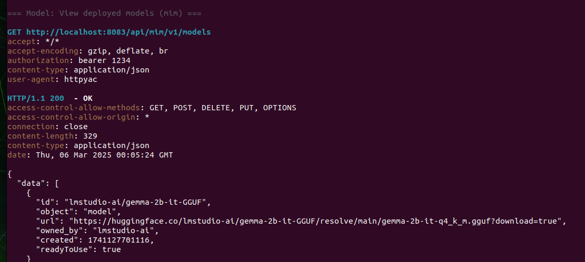
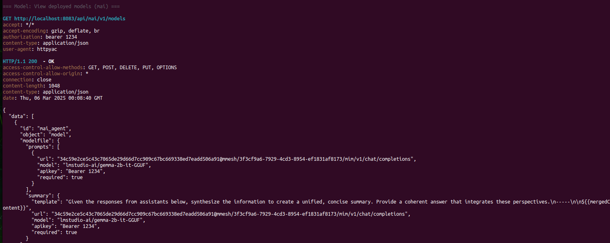
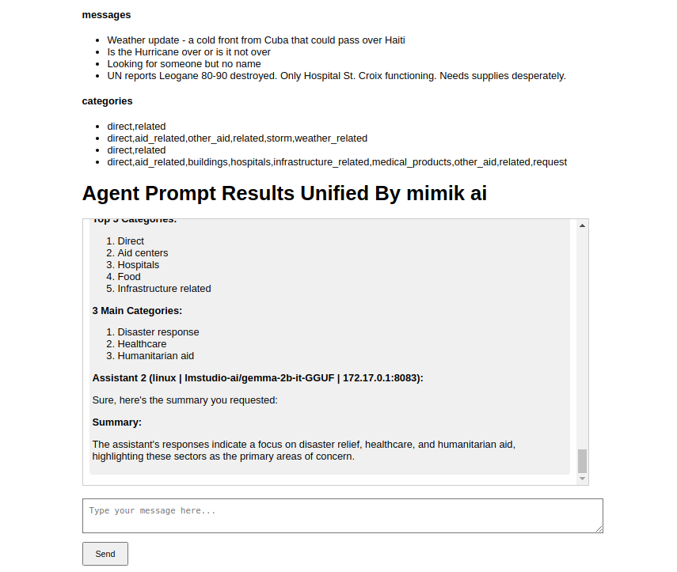
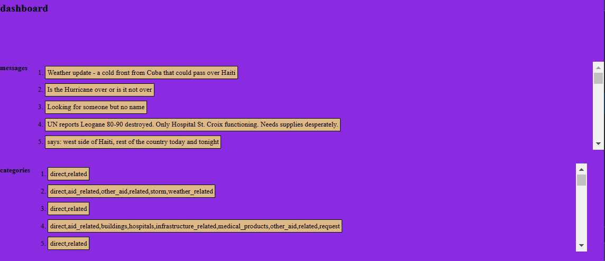

## About

This is part of kwaai hackathon to use mimOE runtime, it uses the following resources:

- https://github.com/mimik-ai/mimik-ai-developer-guide
- https://developer.mimik.com/
- vs code, nodejs, angular js
- gemma model from hugging face running on nvidia gpu with mimOE (please read more at [mimik](https://mimik.com/))

> **please note:** due to being a hackathon project, it is only of under development nature, please see some demos below to get the idea about this project

The project contains a main frontend app built with angular, and it uses 2 backends:
- first backend running at `8080` serves the dataset (private dataset for this project)
- second backend running at `8083` serves the mAI (please read more at this [doc](https://github.com/mimik-ai/mimik-ai-developer-guide))

The frontend app is a template intended to send emergency messages to the *console chat* for classification and summary purposes using mAI coordinator and mILM agents.

> **please note:** the second backend is what serves the `mAI`, which is the coordinator that operates on multiple ai assistants known as `mILM`

## mim mai frontend messages

This project was generated using [Angular CLI](https://github.com/angular/angular-cli) version 19.1.8.

## Development server

To start a local development server, run:

```bash
ng serve
```

Once the server is running, open your browser and navigate to `http://localhost:4200/`. The application will automatically reload whenever you modify any of the source files.

## Plots Library

https://www.npmjs.com/package/angular-plotly.js

## Demo Images/Video

<table>
<tr><td>mILM model(s) deployed using mimOE runtime</td><td></td></tr>
<tr><td>mAI model(s) deployed using mimOE runtime</td><td></td></tr>
<tr><td>console chat sample¹ (link below)</td><td></td></tr>
<tr><td>pretend dashboard² with dataset responses</td><td></td></tr>
</table>

> [console chat sample¹](https://github.com/mimik-ai/mimik-ai-developer-guide/tree/main/01-single-agent-architecture/user-console)


> **pretend dashboard²:** this dashboard loads few messages and categories from the dataset, please feel free to extend the dashboard and use `toggleDetail` template method in `index.html` to switch between the dashboard and the *console chat*; the messages from `src/app/components/dataset/dataset.component.ts` have a template `click` listener already assigned with the selected message

### Video


<br/>

Please note, in the above demo, the query is as following. It is then used for classification and summary purposes using mAI coordinator and mILM agents (assistant-1, assistant-2).

> given categories [ "news", "direct", "social", "aid_centers", "aid_related", "buildings" ... ] assistant-1, please share top 5 categories for "UN reports Leogane 80-90 destroyed. Only Hospital St. Croix functioning. Needs supplies desperately.", assistant-2, please share only 3 main categories of these.

> **please note:** due to large video file-size, video is displayed as a `gif` with optimized settings, please contact [mimik](https://mimik.com/) for more information on such demos